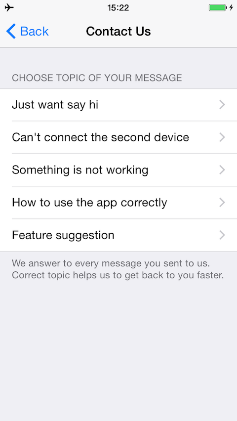

TTLiveAgentWidget-ObjectiveC
=======

Live agent widget for iOS written in ObjectiveC.

This widget is not just an email type of support widget. The TTLiveAgentWidget shows knowledgebase articles to users, so they can quickly find a solution for their issue. It works with any live agent server with API version 1. 

For better performance and security we recommend to use a proxy server. See our proxy server [TTLiveAgentWidget-ProxyServer](https://github.com/tappytaps/TTLiveAgentWidget-ProxyServer).




Instalation
----------

- Requires iOS 6.0+

Manually drop content of `Pod` folder in your project.

Or via CocoaPods:

```
source 'https://github.com/CocoaPods/Specs.git'
platform :ios, '6.0'

pod 'TTLiveAgentWidget-ObjectiveC', :git => 'https://github.com/tappytaps/TTLiveAgentWidget-ObjectiveC.git' 
```

Usage
----------

First thing is to import the widget.

```
#import "TTLiveAgentWidget.h"
```

Before you start using widget you have to configure it. At least you have to set API URL, live agent folder ID where the knowledgebase articles will be obtained, knwledgebase topics and support email. The basic configuration looks like:

```
TTLiveAgentWidget *liveAgentWidget = [TTLiveAgentWidget sharedInstance];

liveAgentWidget.apiURL = @"http://liveagent.server";
liveAgentWidget.apiKey = @"123456";
liveAgentWidget.apiFolderId = @10;
liveAgentWidget.supportEmail = @"support@something.com";

// Set topics
liveAgentWidget.topics = @[
	[[TTLiveAgentWidgetSupportTopic alloc] initWithKey:@"ios-general" :@"General problem"],
	[[TTLiveAgentWidgetSupportTopic alloc] initWithKey:@"ios-problem" :@"Specific problem"]
];

``` 

Best place to config widget is AppDelegate's `didFinishLaunchingWithOptions`. There you should also load new articles from server. So it looks like:

```
TTLiveAgentWidget *liveAgentWidget = [TTLiveAgentWidget sharedInstance];

liveAgentWidget.apiURL = @"http://liveagent.server";
liveAgentWidget.apiKey = @"123456";
liveAgentWidget.apiFolderId = @10;
liveAgentWidget.supportEmail = @"support@something.com";

// Set topics
liveAgentWidget.topics = @[
	[[TTLiveAgentWidgetSupportTopic alloc] initWithKey:@"ios-general" :@"General problem"],
	[[TTLiveAgentWidgetSupportTopic alloc] initWithKey:@"ios-problem" :@"Specific problem"]
];

[liveAgentWidget updateArticles:nil :nil];
```

Then usage of the widget is simple as:

```
// Get Support widget instance
TTLiveAgentWidget *liveAgentWidget = [TTLiveAgentWidget sharedInstance];

// Open widget
[[TTLiveAgentWidget sharedInstance] openFromController:self withStyle:Present];
```

Configuration
----------

On TTLiveAgentWidget you can edit following attributes:

- `topics` - topics of knowledgebase articles
- `maxArticlesCount` - max articles in topic
- `supportEmail` - support email address
- `supportEmailSubject` - subject for support email
- `supportEmailFooter` - Dictionary of parameters for email footer
- `apiURL` - live agent server url
- `apiKey` - live agent api key (you should use proxy server to hide your api key)
- `apiFolderId` - live agent folder id with knowledgebase articles
- `apiLimitArticles` - limit articles from live agent api

If you use `TTLiveAgentWidgetStyle.Present` style (not recommended for `TTLiveAgentWidgetStyle.Push`), you can also configure navigation bar look by these attributes:

- `tintColor` - navigation bar tint color
- `navigationBarCollor` - navigation bar background color
- `titleColor` - navigation bar title color
- `statusBarStyle` - status bar style (UIBarStyle)

API
----------

##### - (void)openFromController:(UIViewController *) controller withStyle:(TTLiveAgentWidgetStyle) style;

Open widget from `controller` with style. Style can be either `TTLiveAgentWidgetStyle.Present` (widget will be presented) or `TTLiveAgentWidgetStyle.Push` (widget will be pushed in navigation controller). If `controller` is not embedded in `UINavigationController` you should use `TTLiveAgentWidgetStyle.Present`. If widget has no articles, then widget open email window directly.

##### - (void)openFromController:(UIViewController *) controller forKeyword:(NSString *) keyword withStyle:(TTLiveAgentWidgetStyle) style;

Open knowledgebase articles directly. If `keyword` is not contained in widget's topics then widget will be opened same way as with `- (void)openFromController:(UIViewController *) controller forKeyword:(NSString *) keyword withStyle:(TTLiveAgentWidgetStyle) style`.

##### - (void)updateArticles:(void (^)())onSuccess :(void (^)())onError;

Asynchronously download articles from live agent. You can handle success or error states.

##### - (void)openEmailComposerFromController:(UIViewController *)controller withTopic:(TTLiveAgentWidgetSupportTopic *)topic;

Opens widget's email composer. Topic is added to email's footer.
